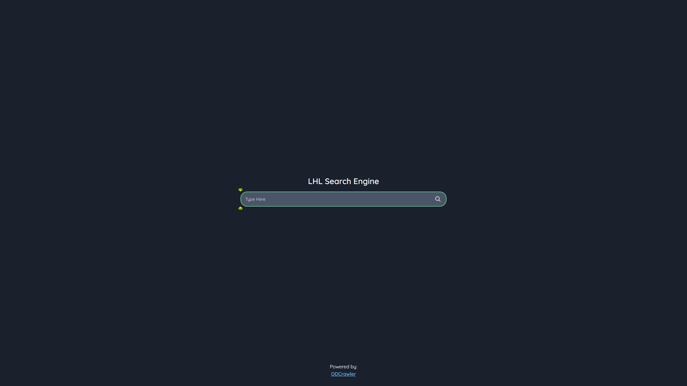
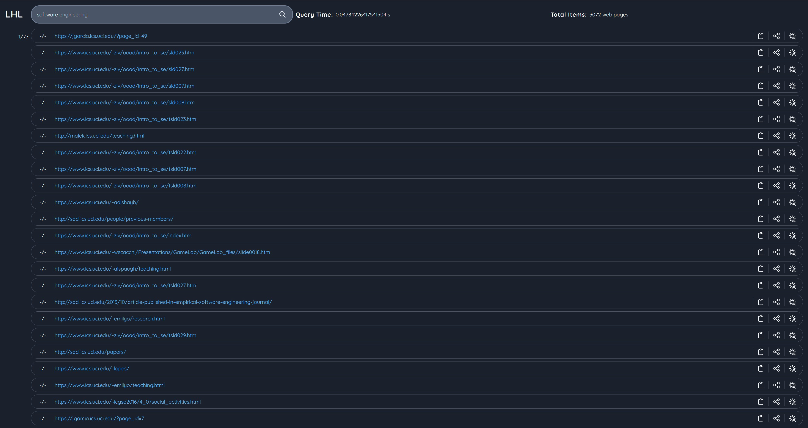

# Simple Search Engine

This is a basic search engine developed by @[lethal233](https://github.com/lethal233), @[WJ-Huang](https://github.com/orgs/swe225-IR/people/WJ-Huang), @[Yang](https://github.com/orgs/swe225-IR/people/yangl77). The engine is a web-based application built using Vue.js and Django.

## [Frontend](https://github.com/swe225-IR/search-engine-frontend)
Leveraging [odcrawler-frontend](https://github.com/Chaphasilor/odcrawler-frontend) as the foundation.

Modification:
- Delete images and Logo
- Display query time and total items

### Search Home Page



### Search Result Page



## [Backend](https://github.com/swe225-IR/assignment3-backend)

### Features

- Detect and eliminate duplicate websites (simhash + hamming distance)
- Ranking algorithm: TF-IDF (0.95) + Page Rank (0.05)
- Index with word positions

RESTFUL API: `http://localhost:8080/api_v2/query?q=machine%20learning&offset=0&limit=40`

```python
@require_http_methods(["GET"])
def get_results(request: WSGIRequest):
    global res
    try:
        query_string = request.GET.get("q")
        offset = int(request.GET.get("offset"))
        limit = int(request.GET.get("limit"))
        start = time.time()
        indexer = Indexer(query=query_string)
        results = indexer.rank(tf_idf_weight=0.95, page_rank_weight=0.05)
        q = time.time() - start
        t = len(results)
        res = UniResponse({'query_time': q, 'total_number': t, "hits": results[offset:offset + limit]})
    except Exception as e:
        print(e)
        res = UniResponse({'query_time': 0, 'total_number': 0, "hits": []}, msg='exception', code=500)
    finally:
        return JsonResponse(UniResponseEncoder().encode(res), safe=False)
```

We get response like this:
```json
{
  "code": 200,                  # response status code
  "msg": "success",             # message
  "data": {
    "query_time": 0.02,         # total query time for terms
    "total_number": 2,          # the number of searched results
    "hits": [                   # details of items
      {
        "doc_id": "1",          # id
        "score": 0.545,         # page score
        "source": {             # source data
          "url": "https://www.yahoo.com/"
        }
      },
      {
        "doc_id": "2",
        "score": 0.643,
        "source": {
          "url": "https://www.uci.edu/"
        }
      }
    ]
  }
}
```

## Dataset

This pertains to all websites within the Information and Computer Sciences department at UC Irvine, as supplied by the instructor.

## Future Extension

- [ ] n-gram indexing
- [ ] Use the index with word positions for retrieval
- [ ] index anchor words for the target pages

## Acknowledge

[odcrawler-frontend](https://github.com/Chaphasilor/odcrawler-frontend)
